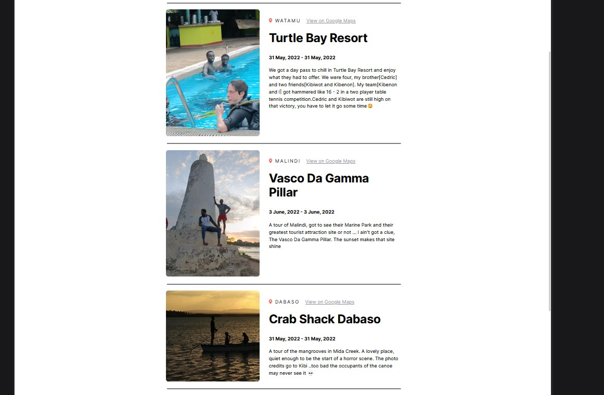

# Scrimba Travel Journal Project {Watamu, Kenya}

This project was bootstrapped with [Create React App](https://github.com/facebook/create-react-app).

This is a solution to the [Scrimba Travel Journal React Project Course on Scrimba](https://scrimba.com/learn/learnreact/react-section-3-solo-project).
The course is offered for FREE on Scrimba by Bob Ziroll [Learn React](https://scrimba.com/learn/learnreact)(An amazing tutor -- really understood his course)

I decided to show my travel experience in Watamu, Kenya. I visited this place after completing my 4th Year studies in Uni

## Table of contents

- [Overview](#overview)
  - [The challenge](#the-challenge)
  - [Screenshot](#screenshot)
  - [Links](#links)
- [My process](#my-process)
  - [Built with](#built-with)
  - [What I learned](#what-i-learned)
  - [Continued development](#continued-development)
- [Author](#author) -[Acknowledgments](#acknowledgments)

## Overview

### The challenge

Use your own experience to create a travel journal

Requirements : -

- Build from Scratch!
- Add data dynamically from `data.js` file that contains the:-
  -Title, location, Google Maps link, sart date, end date, description, image URL
- Use `map()` using `props`
- Enjoy the build

### Screenshot

Screenshot of My Watamu Mombasa Travel Journal



### Links

- Solution URL: [GitHub Link](https://github.com/issagoodlifeInc/watamu.git)
- Live Site URL: [Netlify Deploy](https://Watamu.netlify.app/)

## My process

First worked on the NavBar and Main sections as per the [Figma model](<https://www.figma.com/file/hgjw0ocCdOAaixu4g2kbS4/Travel-Journal-(Copy)?node-id=2%3A2>) shared on Scrimba
Then worked on the `Travel` by:-

1. Adding the `main` section on the `App` below the `<Navbar />` part

2. Adding the `<Travel />` part on the `App` by mapping through the data file

```js
function App() {
  const myData = data.map((data) => {
    return <Travel key={data.id} {...data} />;
  });
  return (
    <div className="App">
      <Navbar />
      <main className="container">{myData}</main>
    </div>
  );
}
```

3. Using `props` to display info from the `data` file in the `Travel` section

```js
<div className="travel-img">
  
</div>
```

4.Styling out the `Travel` section and going through my archives to find travel destinations worth putting into the Journal

6. Adding data from my Coastal Kenya retreat that I took with my brother and friends at the end of May, 2022

7. Writing out this `README.md` file

### Built with

- React
- JSX syntax
- Semantic HTML5 markup
- CSS custom properties
- Flexbox

### What I learned

- Using `props` and `mapping` in React

```js
const myData = data.map((data) => {
  return <Travel key={data.id} {...data} />;
});
```

```js
return (
  <h4 className="travel-dates">
    {props.startDate} - {props.endDate}
  </h4>
);
```

- Inserting images by requiring the when in the src folder
  Spent a whole load of time working on this finally it worked after snooping on solutions to this in the [#today-I-did](https://discord.com/channels/684009642984341525/919153471691849769/985538609430016000) channel in the Scrimba Discord Community

```js
const src = require(`../images/${props.imgUrl}`);
```

- Using Figma files to code

- React! React! React!

### Continued development

- Learning more React! (yeah reenacting React problems and tackling them)

- Better turnaround time -- simple stuff but worked on it for a while

- Less Code (code cleanup)

## Author

- Website - [Lesley Kimutai](https://leskim.github.io/myweb/)
- Frontend Mentor - (https://www.frontendmentor.io/profile/Leskim)
